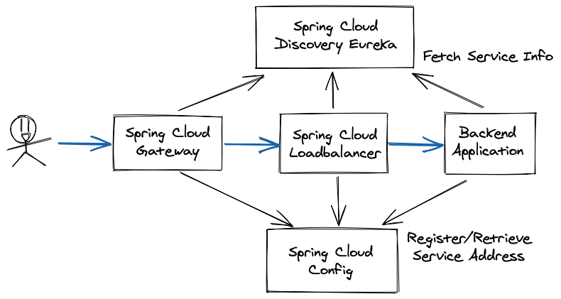
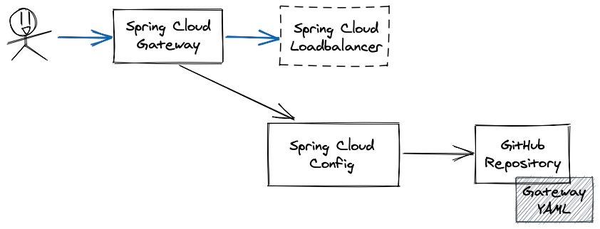
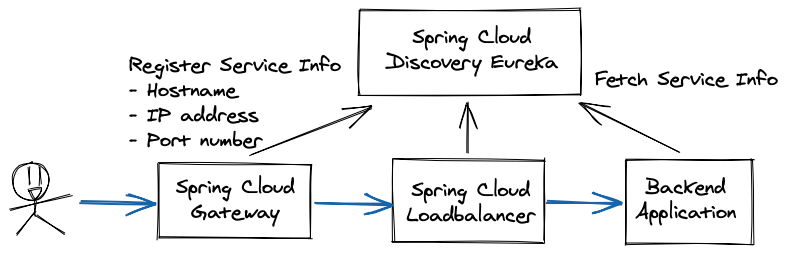

# Spring Cloud Getting Started

Spring Cloud provides various useful functions to solove the distributed architecture like Microservices.
This application uses the following services:
- Spring Cloud Gateway
- Spring Cloud Loadbalancer
- Spring Cloud Config Server
- Spring Cloud Eureka

|Spring Cloud|Functions|
|------------|---------|
|Spring Cloud Gateway|API Gateway|
|Spring Cloud Loadbalancer|Load Balancing|
|Spring Cloud Config Server|Configuration Management|
|Spring Cloud Eureka|Service Discovery|


## Description



### Related Repository

- https://github.com/shinyay/spring-cloud-gateway-gs
- https://github.com/shinyay/spring-cloud-loadbalancer-gs
- https://github.com/shinyay/spring-cloud-config-gs
- https://github.com/shinyay/spring-cloud-eureka-server-gs
- https://github.com/shinyay/spring-cloud-config-client-gs

### Role for each Services
#### 1. Spring Cloud Gateway
Spring Cloud Gateway provides **APIs** and **cross cutting concerns** to APIs such as security, metrics and resiliency.

- Features
  - Match routes on any request attribute
  - Predicates and filters are specific to routes
  - Request Rate Limiting
  - Path Rewriting
  - Spring Cloud DiscoveryClient integration

##### Implementation
Register routing configuration ro Loadbalancer service into Config Server



```yaml
spring:
  cloud:
    gateway:
      discovery:
        locator:
          enabled: true
      routes:
        - id: loadbalancer
          uri: lb://loadbalancer
          predicates:
            - Path=/myapp/**
          filters:
            - RewritePath=/myapp/(?<path>.*), /$\{path}
```

#### 2. Spring Cloud Config
Spring Cloud Config provides server-side and client-side support for **externalized configuration** in a distributed system.The default implementation of the server storage backend uses git.

- Background Repository Environment
  - Github
  - Google Code Source Repository
  - AWS Code Commit
  - File System
  - Vault
  - JDBC
  - Redis
  - AWS S3
  - CredHub

##### Implementation
The following configuration should be put in Spring Cloud Config Client side Service

```yaml
spring:
  cloud:
    config:
      server:
        git:
          uri: https://github.com/your-account/config-repo.git
          search-paths: repos/
```
- uri
  - The URI of the Git repository
  - It begins with http://, https://, git@, or ssh://
- search-paths
  - An array of strings used to search subdirectories of the Git repository
- pattern
  - An array of strings used to match an application name
  - use the {application}/{profile} format with wildcards
- default-label
  - The default label of the Git repository, should be the branch name, tag name, or commit-id of the repository


#### 3. Spring Cloud Netflix Eureka
Spring Cloud Netflix Eureka provides **service-discovery** which allow services(Eureka Client) find and communicate with each other without hostname and port hard-coded.



##### Implementation
The following configuration should be put in Eureka Client side Service

```yaml
eureka:
  client:
    service-url:
      default-zone: ${EUREKA_URI:http://localhost:8761/eureka}
```

#### 4. Spring Cloud Loadbalancer
Spring Cloud LoadBalancer provides client-side load-balancing in calls to another microservice, which used to provided with Netflix Ribbon.

## Demo

## Features

- feature:1
- feature:2

## Requirement

## Usage

## Installation

## Licence

Released under the [MIT license](https://gist.githubusercontent.com/shinyay/56e54ee4c0e22db8211e05e70a63247e/raw/34c6fdd50d54aa8e23560c296424aeb61599aa71/LICENSE)

## Author

[shinyay](https://github.com/shinyay)
